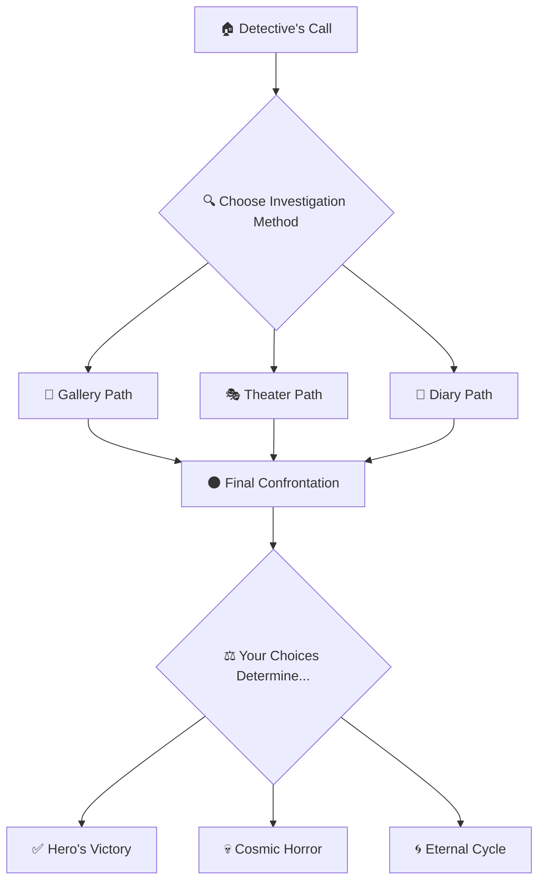

<div align="center">

# 🌑 O ÚLTIMO ATO DO REI 👑

[](#)
[](#)
[](#)
[](#)

*"Carcosa's shadows reach through time and space..."*


</div>

---

## 🎭 **THE INVESTIGATION BEGINS**

<div align="center">

</div>

Entre na pele de um **detetive** investigando mortes misteriosas ligadas a uma **seita obscura**. Cada escolha molda sua **sanidade** e determina seu destino neste thriller psicológico onde a realidade se desfaz diante de **forças antigas e incompreensíveis**.

> *"Strange is the night where black stars rise,  
> And strange moons circle through the skies..."*

---

## 🎯 **CORE MECHANICS**

<table>
<tr>
<td width="50%">

### 🎲 **D20 SYSTEM**
- Testes de habilidade em **3D interativo**
- **Arquétipos** únicos com bônus específicos
- **Dificuldades** dinâmicas baseadas na narrativa

### 🧠 **SANITY SYSTEM** 
- **Barra visual** que reage ao terror
- **Efeitos perturbadores** conforme sanidade diminui
- **Consequências** permanentes nas escolhas

</td>
<td width="50%">

### 📖 **BRANCHING NARRATIVE**
- **Múltiplas escolhas** com consequências reais
- **Sistema de pistas** para desvendar mistérios
- **Finais diferentes** baseados em suas ações

### 🎨 **ATMOSPHERIC HORROR**
- **Filtros vintage** para estética noir
- **Efeitos sombrios** que se intensificam
- **Design responsivo** otimizado para paisagem

</td>
</tr>
</table>

---

## 🎪 **TECHNICAL FEATURES**

<div align="center">


</div>

```swift
// 🌑 Dynamic sanity effects
func triggerSanityEffects() {
    darkFlash = true
    screenShake = CGFloat.random(in: -3...3)
    textTremor = true
    
    if manager.sanity <= 30 {
        symbolAppear = true
        AudioManager.shared.playHorrorStinger()
    }
}
```

### 🔧 **Architecture Highlights**

- **🎯 MVVM Pattern** with ObservableObject game state
- **🎵 Dynamic Audio System** with scene-based music
- **🎲 3D Dice Mechanics** using WebView + Three.js
- **📱 Responsive Design** supporting multiple device sizes
- **🌊 Smooth Animations** with Core Animation integration

---

## 🎬 **GAME SHOWCASE**

<div align="center">

### 🏛️ **THE GALLERY SCENE**
*Where art becomes nightmare...*


### 🎭 **THE THEATER INVESTIGATION** 
*Ancient secrets hide in the shadows...*


### 🎲 **DICE SYSTEM IN ACTION**
*Fate decides in the cosmic void...*


</div>

---

## 🚀 **PLAY NOW**

<div align="center">

### 📱 **Available on TestFlight**

[](https://testflight.apple.com/join/CzQgMcyv)

**Scan to Enter the Cosmic Horror:**


*🔗 [Direct Link: https://testflight.apple.com/join/CzQgMcyv](https://testflight.apple.com/join/CzQgMcyv)*

</div>

### 📋 **Requirements**
- iOS 16.0+
- iPhone/iPad with TestFlight app
- Device orientation: **Landscape**
- Headphones recommended for full atmospheric experience

### 🎵 **Audio Setup**
```
📁 Required Audio Structure:
├── Audio/
│   ├── Music/          # Background themes
│   ├── SFX/            # Sound effects  
│   └── Narration/      # Voice acting (optional)
```

---

## 🎨 **VISUAL DESIGN PHILOSOPHY**

<div align="center">

| 🌑 **Dark Aesthetics** | 🎭 **Noir Elements** | 👻 **Horror Effects** |
|:---:|:---:|:---:|
| Deep blacks & shadows | Film grain filters | Sanity-based distortions |
| Muted color palette | Vintage scan lines | Reality glitch overlays |
| Atmospheric gradients | Golden accent colors | Dynamic screen tremors |

</div>

---

## 🎯 **GAMEPLAY FLOW**



---

## 👥 **CHARACTER ARCHETYPES**

<div align="center">

| 🕵️ **INVESTIGATOR** | 💪 **INTIMIDATOR** | 🗣️ **PERSUADER** |
|:---:|:---:|:---:|
| **Reasoning** +3 | **Intimidation** +3 | **Persuasion** +3 |
| **Investigation** +3 | **Strength** +3 | **Perception** +3 |
| *Uncovers hidden truths* | *Forces information* | *Charms their way through* |

</div>

---

## 🌟 **SPECIAL FEATURES**

### 🎲 **3D Dice System**
- Real-time **Three.js** powered dice rolling
- **Physics-based** animations
- **Atmospheric** lighting effects

### 🧠 **Dynamic Sanity**
- **Visual corruption** increases with madness
- **Audio distortion** reflects mental state  
- **Gameplay consequences** for low sanity

### 🎵 **Immersive Audio**
- **Scene-specific** background music
- **Interactive** sound effects
- **Optional narration** system

---

## 📱 **DEVICE COMPATIBILITY**

<div align="center">

| Device | Screen Size | Status |
|:---:|:---:|:---:|
| iPhone 16 Pro | 6.3" | ✅ **Optimized** |
| iPhone 15 | 6.1" | ✅ **Supported** |
| iPhone 14 | 6.1" | ✅ **Supported** |
| iPhone SE | 4.7" | ⚠️ **Limited** |
| iPad | All sizes | 🔄 **Planned** |

</div>

---

## 🎨 **ASSETS NEEDED**

Para usar este projeto, você precisará adicionar:

### 📁 **Images** (substitua os placeholders):
```
Assets/
├── apartamento.jpg     # Detective's apartment scene
├── galeria.jpg         # Art gallery scene  
├── teatro.jpg          # Theater scene
├── covil.jpg           # Final confrontation
├── diario1.jpg         # Diary page 1
├── diario2.jpg         # Diary page 2
├── diario3.jpg         # Diary page 3
└── symbol_overlay.png  # The Yellow Sign
```

### 🎵 **Audio Files**:
```
Audio/
├── Music/
│   ├── investigation_theme.mp3
│   ├── gallery_ambience.mp3
│   ├── theater_mystery.mp3
│   ├── diary_reading.mp3
│   └── final_confrontation.mp3
└── SFX/
    ├── dice_roll.mp3
    ├── success_chime.mp3
    ├── failure_drone.mp3
    ├── sanity_loss.mp3
    ├── clue_found.mp3
    ├── scene_transition.mp3
    └── horror_stinger.mp3
```

---

## 🏗️ **PROJECT STRUCTURE**

```
FebreAmarela/
├── 📱 App/
│   ├── FebreAmarelaApp.swift       # Main app & vintage filters
│   └── ContentView.swift          # Navigation controller
├── 🎮 Views/
│   ├── GameView.swift              # Main game interface
│   ├── DialogueView.swift          # Text display system
│   ├── ChoicesView.swift           # Interactive choices
│   ├── DiceRollOverlayView.swift   # 3D dice mechanics
│   └── NotebookView.swift          # Clue management
├── 🎯 ViewModels/
│   ├── GameManager.swift           # Game state management
│   └── AudioManager.swift          # Audio system
├── 📊 Models/
│   └── StoryModels.swift           # Data structures
├── 🎵 Audio/
│   ├── Music/                      # Background themes
│   ├── SFX/                        # Sound effects
│   └── Narration/                  # Voice acting
└── 📖 Resources/
    └── Story.json                  # Narrative content
```

---

## 🎭 **DEVELOPMENT NOTES**

### 🎨 **Design Principles**
- **Cosmic Horror Aesthetics** - Deep blacks, golden accents, vintage filters
- **Atmospheric Immersion** - Every visual element serves the narrative mood
- **Responsive Terror** - UI corruption increases with character's madness

### 🔧 **Technical Decisions**
- **SwiftUI + Combine** for reactive state management
- **JSON-driven narrative** for easy content modification
- **WebView integration** for advanced 3D dice rendering
- **AVFoundation** for professional audio experience

---

<div align="center">

## 🌟 **ENTER THE COSMIC HORROR**

[](https://testflight.apple.com/join/CzQgMcyv)

---

### 🎪 **Made with 🖤 and existential dread**

*"The King in Yellow watches over this code..."*


**⚠️ WARNING: This project may cause temporary reality distortion**

---

*Built during the NanoChallenge 2025*  
*Where madness meets mobile development* 🌑📱
"Ph'nglui mglw'nafh Cthulhu R'lyeh wgah'nagl fhtagn..."
</div>
